# Hammer — TryHackMe Writeup

Writeup for the [Hammer](https://tryhackme.com/room/hammer) room on TryHackMe.
Two flags: an authentication bypass via a brute-forceable password-reset flow, and a privilege-escalation-to-RCE chain via JWT `kid` header injection.

## Recon

Nmap shows two open ports: `22` (SSH) and `1337` (HTTP), which hosts a login page.

An initial directory scan with a standard wordlist doesn't turn up much of interest.

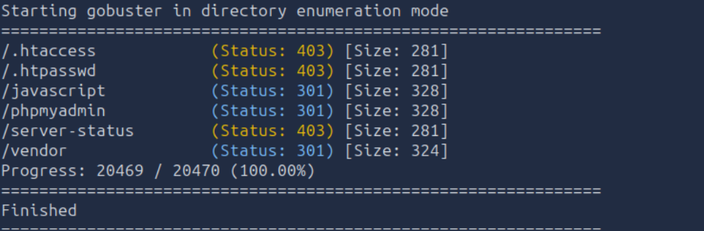

Checking the login page's source reveals a developer comment: all app directories must be prefixed `hmr_`.

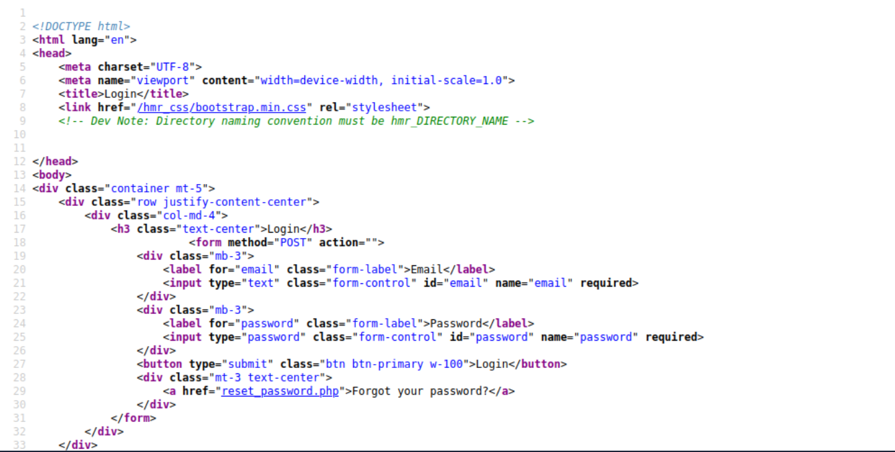

Re-running `ffuf` with that prefix uncovers a `hmr_logs` directory.

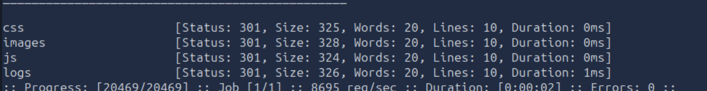

`hmr_logs/error.logs` leaks a valid application email address, `tester@hammer.thm`.

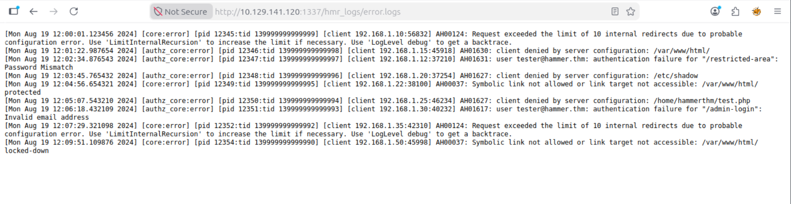

## Flag 1 — Authentication bypass (`THM{AuthBypass3D}`)

Using the leaked email on the "forgot password" flow triggers a 4-digit recovery code, valid only for a short time window — small enough of a search space to brute-force before it expires.

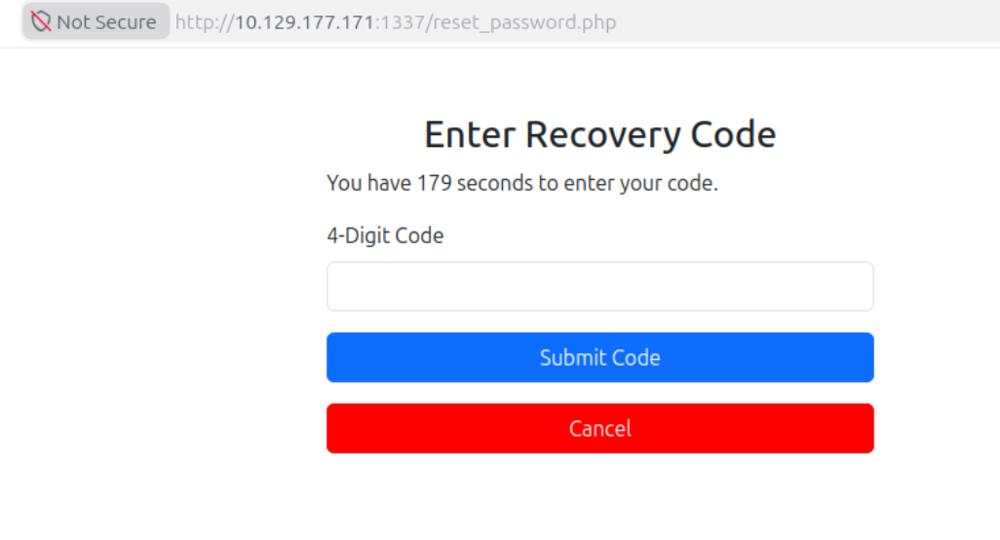

Automating with `ffuf` against all 10,000 combinations, spoofing `X-Forwarded-For` per request to dodge rate-limiting:

\`\`\`bash
seq 0000 9999 > numbers.txt
ffuf -w numbers.txt -u "http://<TARGET_IP>:1337/reset_password.php" \
  -X POST -d "recovery_code=FUZZ&s=60" \
  -H "Cookie: PHPSESSID=<session>" \
  -H "X-Forwarded-For: FUZZ" \
  -H "Content-Type: application/x-www-form-urlencoded" \
  -fr "Invalid" -s
\`\`\`

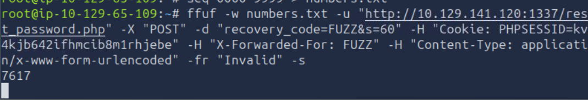

The correct code resets the password:

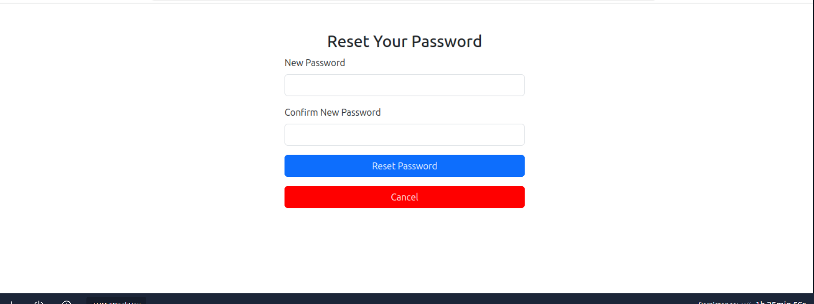

Logging in with the new credentials:

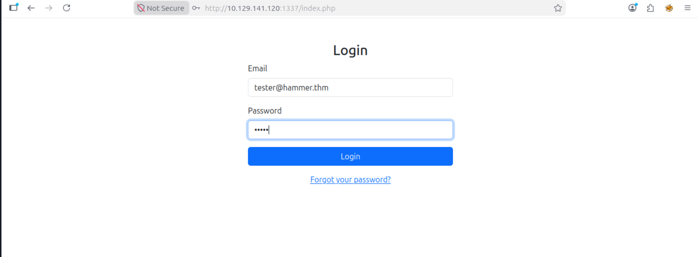

**Flag 1:** `THM{AuthBypass3D}`

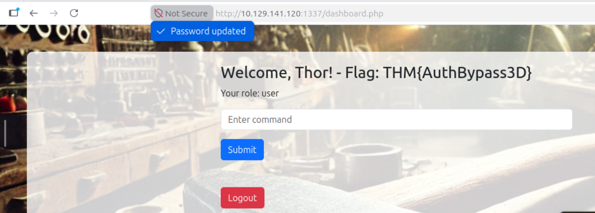

## Flag 2 — JWT `kid` injection → RCE (`THM{RUNANYCOMMAND1337}`)

The dashboard exposes a command runner (`execute_command.php`), authorized via a JWT bearer token. Decoding the token shows a `kid` (Key ID) header pointing to a local key file path, and a `role: user` claim.

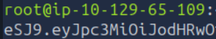

Since the app trusts the `kid` path to locate the signing key, fetching that file directly discloses the actual signing secret:

\`\`\`bash
curl -s http://<TARGET_IP>:1337/188ade1.key
\`\`\`

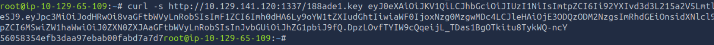

With the real secret in hand, a new JWT can be forged with `role: admin`, signed correctly:

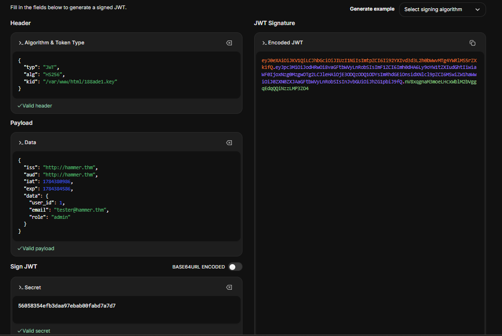

The signature verifies:

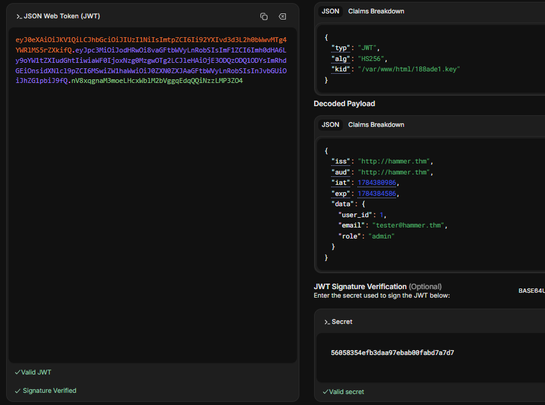

Swapping the forged token into the `Authorization` header (and cookie) and hitting `execute_command.php` returns the second flag:

**Flag 2:** `THM{RUNANYCOMMAND1337}`

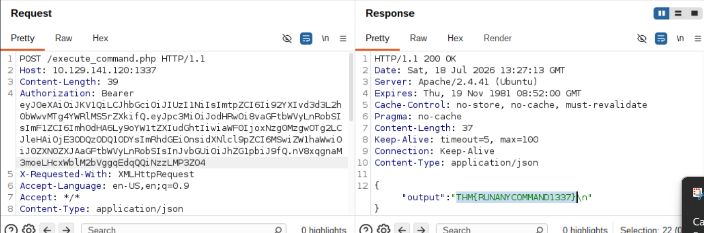

## Takeaways

- Recovery codes need proper rate-limiting that can't be bypassed with a spoofable header like `X-Forwarded-For`, and a 4-digit numeric OTP (only 10,000 possibilities) is far too small a search space regardless — it should be longer and alphanumeric to resist brute-forcing even without rate-limit bypass.
- Never derive a JWT signing key path from an attacker-controlled `kid` header — validate it against an allowlist, or better, don't store the key on a web-accessible path at all.
